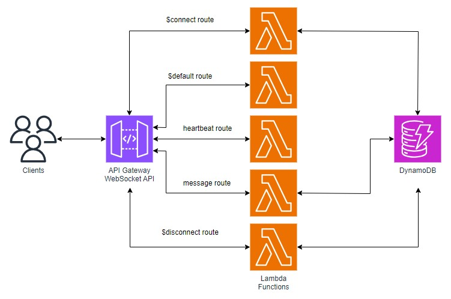

# Amazon API Gateway WebSocket API demo

This is the Amazon Web Services (AWS) Cloud Development Kit (CDK) backend for a Unity game that uses an authenticated WebSocket connection to pass game actions between players.

<br />
*Reference architecture for the WebSocket API*

The sample AWS CDK code deploys an API Gateway WebSockets API with the following routes:
* $connect – handles client connections
* $default – default route that doesn’t perform any function
* heartbeat – prevents idle timeout by keeping the connection alive
* message – handles client messages to other connected clients
* $disconnect – handles client disconnections

Each route has a Lambda function integration which receives the request information and performs an action. Connection state is maintained inside a DynamoDB table. When a client connects via the $connect route, the Lambda integration is executed and the connection ID is stored in the table. When a client disconnects, the $disconnect Lambda integration is executed and the connection ID is removed from the table. When a client sends a message to the message route, the Lambda integration retrieves all connection IDs from the DynamoDB table and broadcasts the message to all other connected clients.

In addition to the WebSocket API architecture, Amazon Cognito is used to authenticate users when connecting to the WebSocket API. A configuration file is generated when this code is deployed, which provides a local credentials cache for the associated Unity application's Cognito login process.


## Prerequisites
* An [AWS Account](https://aws.amazon.com/) 
* [AWS CLI](https://github.com/aws/aws-cli#getting-started) installed and configured.
* [Node.js](https://nodejs.org/en/download/) v14.15.0+
* [AWS CDK](https://docs.aws.amazon.com/cdk/v2/guide/getting_started.html)

## Steps to create the backend on your AWS Account
1. Navigate to the AWS_CDK directory.
2. ```npm run install-all``` to install all dependencies.
4. ```export CDK_DEFAULT_REGION=<your-desired-region>``` to set the default AWS region, e.g. `us-east-1`.
5. ```export CDK_DEFAULT_ACCOUNT=<your-aws-account>``` to set the default AWS account, e.g. `123456789012`.
6. ```cdk bootstrap``` to bootstrap your AWS Account.
7. ```cdk deploy WebSocketDemoStack --parameters AdminEmailAddress="<insert-your-email>"``` to deploy.
8. Download the `aws-config.json` from the Config S3 bucket in your account. This will be used to authenticate users to the Amazon API Gateway WebSocket API.
9. ```aws cognito-idp admin-set-user-password --user-pool-id <User Pool from Config file> --username <insert-your-email> --password <insert-your-password> --permanent``` to set the password for your admin account.
10. [Return to the application setup README.](../README.md)

## Clean up
When you are finished with this demo you should destroy the deployed AWS resources to avoid unwanted costs. To destroy the resources:
1. Navigate to the AWS_CDK directory.
2. ```cdk destroy``` to destroy all deployed resources.

